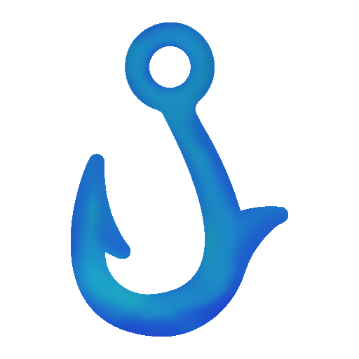

<p align="center">
  
</p>

<h1 align="center">Nova Scotian Anglers Guild Project</h1>

A TypeScript **installable PWA** that turns **live ocean + weather + tide data** into an actionable
shore-fishing plan for **McCormacks Beach, Eastern Passage, Nova Scotia** (and anywhere in NS) - plus a
personal catch log that learns your patterns over time, a members-only login, and a live guild map
where members can see each other's location as coloured hooks.

## What it does

- **Live conditions** - air/water temp, wind, gusts, barometric pressure & trend, wave height,
  tide state, moon phase & illumination, sunrise/sunset.
- **Fishing score & windows** - an overall 0-10 score per day and the best/second-best fishing
  windows, computed from tidal flow, dawn/dusk low light, wind, waves, pressure trend, cloud
  cover and spring/neap moon strength.
- **Species forecast** - encounter % / catch % / best time / best spot / rig / bait / size /
  eating quality / **NS retention legality** for mackerel, herring, pollock, cod, haddock, winter &
  smooth flounder, striped bass and cunner.
- **Interactive tide chart** (SVG) with high/low markers, "now" line and shaded best windows.
- **Hourly breakdown** with a colour-coded rating and the reasons behind each hour.
- **Hotspot ranking** - boardwalk, island-facing shore, rocky points, current seams, sandy flats,
  deep channel edges - re-ranked daily for wind shelter and current.
- **Tactics & action plan** - setup, lure colours, bait, retrieval, arrival/departure times and an
  exact "put fish on the table" step list.
- **Catch log** (saved in your browser) + **pattern analysis / predictive model** that correlates
  your catches with tide stage, time of day, wind, moon and weather. Export/import as JSON.
- **Full text briefing** in the requested report format, one click to copy.
- **Members-only login** (Nova Scotian Anglers Guild) - the whole app is gated behind a sign-in.
- **Live guild map** - opt in with **📡 Share location** and the guild sees your hook move in
  near-real-time; each member has their own coloured hook. Sharing is per-device, off by default,
  and disappears the moment you turn it off or close the app.
- **Admin member management** - the admin (Tony) gets a **👥 Members** panel to create accounts
  (username + password), set each member's hook colour, grant/revoke admin, reset passwords or
  remove members. New members can't be self-registered; only an admin can add them.
- **Installable PWA** - install to your phone's home screen and it launches full-screen; the app
  shell works offline (live data still needs a connection).

## Guild membership

The app is members-only. The first admin is **Tony** (seeded once - see the deploy steps below).
Default password is `fishon`; change it right away in **👥 Members → Your account**. Once signed in,
Tony adds the rest of the guild from the Members panel (username + password, no email).

## Backends

The frontend speaks to one of two interchangeable backends, chosen automatically:

- **Firebase (recommended, free)** - used when Firebase config is present (`VITE_FIREBASE_*`).
  Firebase Hosting (PWA) + Firebase Auth (login) + Cloud Firestore (members + live presence). Runs
  entirely on the free **Spark** plan, no credit card. This is the hosted/production path.
- **Self-hosted Node + SQLite** - used when no Firebase config is set. A small `server/` (only dep:
  `ws`; SQLite via built-in `node:sqlite`) for fully local/offline-network use. See "Self-hosted" below.

## Data sources (free, no API key)

- **Tides** - Fisheries and Oceans Canada / CHS **IWLS** API (Halifax gauge, station 00490 - the
  same harbour system as Eastern Passage). Falls back to an approximate model if the API is
  unreachable (clearly flagged).
- **Weather & marine** - **Open-Meteo** forecast + marine APIs (wind, pressure, cloud, precip,
  wave height, sea-surface temperature, sunrise/sunset).
- **Moon phase / spring-neap strength** - computed locally.
- **Tagged ocean predators** - **OCEARCH** named, satellite-tagged animals (via the public Mapotic feed).

## Deploy to Firebase (free, recommended)

Everything below stays on Firebase's free **Spark** plan - no billing account.

**1. Create the project & services** (Firebase console, console.firebase.google.com):
- Create a project (Google Analytics optional).
- **Build → Authentication → Get started → Sign-in method → enable Email/Password.**
- **Build → Firestore Database → Create database → Production mode** (any region).
- **Project settings → General → Your apps → Web app (`</>`)** → register, then copy the config.

**2. Configure the app:**
```bash
npm install
cp .env.example .env.local        # then paste your VITE_FIREBASE_* values into .env.local
```

**3. Seed the admin (Tony), one time:**
- Console → **Project settings → Service accounts → Generate new private key** → save as
  `serviceAccountKey.json` in the project root.
```bash
npm i -D firebase-admin
node scripts/firebase-seed.mjs    # creates Tony / fishon (override via GUILD_ADMIN_USER/PASSWORD)
```

**4. Deploy:**
```bash
npm i -g firebase-tools
firebase login
firebase use --add                # pick your project (writes .firebaserc)
npm run build                     # outputs dist/
firebase deploy --only firestore:rules,hosting
```

Open the Hosting URL, sign in as **Tony**, and add your guild from **👥 Members**. Firebase Hosting is
HTTPS by default, so live location sharing works for everyone. "Install app" from the browser to get
the PWA on a phone home screen.

> Free-plan note: an admin can create members, set hook colours, grant/revoke admin and **disable**
> accounts; members change their own password. Admin-initiated password *resets* and hard account
> deletion need the Blaze plan (still ~$0 for a small guild) - on Spark, disable + recreate instead.

## Run it locally (dev)

Against Firebase (uses your `.env.local`):
```bash
npm run dev               # http://localhost:5180, talks to your Firebase project
```

### Self-hosted (Node + SQLite, no Firebase)

If you'd rather not use Firebase, leave `VITE_FIREBASE_*` unset and run the bundled server (only dep:
`ws`; SQLite is Node's built-in `node:sqlite`):
```bash
# Terminal 1 - guild server on http://localhost:8787 (seeds Tony / fishon)
npm run server:install
npm run server
# Terminal 2 - the app
npm run dev               # http://localhost:5180, auto-talks to localhost:8787
```
For production self-hosting, `npm run build` then `npm start` serves the PWA + API + WebSocket on one
origin. Live sharing then needs HTTPS (a reverse proxy, or a host like Render/Fly.io).

## ⚠ Regulations

Retention guidance is general. **Always verify current DFO Maritimes recreational regulations**
(open seasons, size/slot limits, daily limits, licences, barbless-hook rules) before keeping any
fish. Mackerel, Atlantic cod/haddock (groundfish) and striped bass in particular are tightly and
seasonally regulated - when in doubt, release.

## Project layout

```
src/
  config.ts            location, species DB, NS reg notes, weather codes
  types.ts             shared domain types (+ GuildUser, AnglerPresence)
  data.ts              orchestrates the live fetch + merge
  services/            weather (Open-Meteo), tides (IWLS), astronomy (moon),
                       ocearch (tagged animals), api (backend facade), presence (live map),
                       firebase (init), firebase-backend (Auth + Firestore + presence)
  engine/              merge, scoring/windows, species, hotspots, tactics,
                       patterns (log analysis), context, briefing
  store/log.ts         catch log persistence (localStorage)
  ui/                  app shell + SVG charts + login + admin (Members panel) + map
public/
  manifest.webmanifest, sw.js   PWA manifest + offline service worker
firebase.json          Firebase Hosting + Firestore config
firestore.rules        Firestore security rules (members/admin/presence)
.env.example           Firebase web config template (copy to .env.local)
scripts/firebase-seed.mjs   one-time admin (Tony) seed via firebase-admin
server/                OPTIONAL self-hosted backend (Node + SQLite, dep: ws)
  index.js             HTTP API + WebSocket live presence
  auth.js              scrypt password hashing + signed tokens (node:crypto)
  db.js                node:sqlite schema, admin seed, colour palette
```
